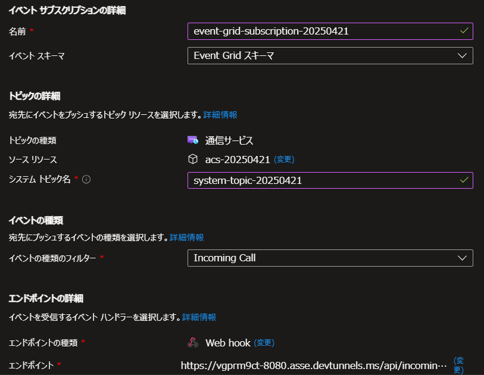

# サンプルアプリ利用手順
ローカル向けの利用手順と Azure 利用向けの利用手順をまとめます。

## ローカル環境のセットアップ
### 仮想環境のセットアップ
仮想環境を作成する。
```
python -m venv .venv
```

仮想環境を有効化する。
```
source .venv/bin/activate
```

以下のコマンドで Rust をインストールする。Rust は pydantic_settings のモジュールのインストールに必要。実行後にインストールのオプションを聞かれるので `1) Proceed with Standard installation` を選択する。
```
curl -sSf https://sh.rustup.rs | sh
```

以下のコマンドを実行して Rust のパスを通す。(コマンドは Linux 用)
```
export PATH="$HOME/.cargo/bin:$PATH"
```

Rust のパスが通っていることを確認する。
```
cargo --version
```

Python モジュールをインストールする。
```
pip install -r requirements.txt
```

### 環境変数の設定
.env.sample を参考にして .env を作成する。

### アプリケーションの起動
アプリケーションを起動する。
```
python app.py
```

### DevTunnel のセットアップ
DevTunnel を作成する。
```
devtunnel create --allow-anonymous
```

ポート 8080 でアクセス可能にする。
```
devtunnel port create -p 8080
```

DevTunnel を起動してローカルアプリを外部公開する。
```
devtunnel host
```

### Azure Communication Service の準備
Azure ポータルより、ACS (Azure Communication Service) の作成と電話番号の取得を行ってください。

### Azure Event Grid Subscription の設定
基本タブでは以下のように設定する。イベントの種類のフィルターは「Incoming Call」を指定し、エンドポイントの種類は「Webhook」でエンドポイントは「<DevTunnel の URL>/api/incomingCall」を入力する。


フィルタータブでは以下のように設定する。キーは「data.to.PhoneNumber.Value」とし、演算子は「次の文字列で始まる」を選択する。値は着呼側 (ACS で取得した電話番号) の電話番号を入力する。


上記の入力が完了したら Azure Event Grid Subscription リソースの作成を行う。作成の際、DevTunnel によってローカルアプリをインターネット公開しておく必要があることに留意。

### 電話をかける
